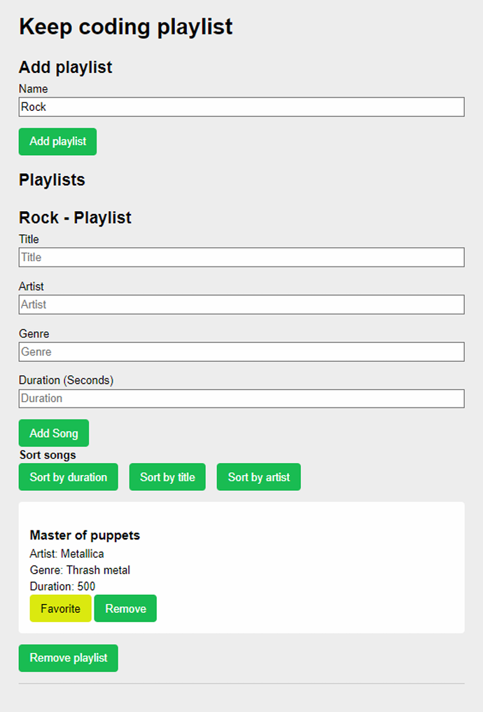
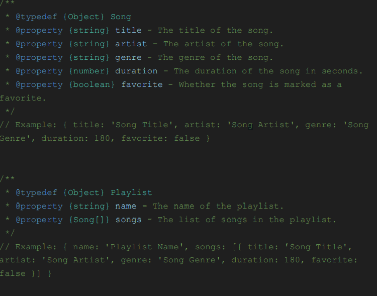

# Ejercicios de Intro-JS

### Ejercicio 1:

 > Crea un archivo **ejercicio1.js** que tenga un objeto llamado usuario con los siguientes
 campos:
 - Nombre (el tuyo o inventado)
 - Apellidos (el tuyo o inventado)
 - Una lista con los temas del bootcamp Node.js, Git y react con sus nombres y fechas
 de inicio de cada módulo. Fecha en formato “YYYY-MM-DD”
 - Si estás en búsqueda activa con un valor de verdadero o false
 
 En este archivo queremos mostrar por pantalla la fecha de inicio del módulo de react del
 objeto que hemos creado anteriormente.

---

 ### Ejercicio 2:
 *Arreglar bug*
 
 > Nuestro cliente está intentando calcular el promedio de una lista de números pero nos dice
 que no funciona. No nos da el error, solo este código que es el que tiene en producción.
 Para este ejercicio tenemos que crear un archivo llamado **bug.js** con la solución.

```js
const calcularPromedio = (numeros) => {
let sumaTotal = 0;
for (let i = 0; i <= numeros.length; i++) {
sumaTotal += numeros[i];
}
const promedio = sumaTotal / numeros.length;
return promedio;
};
const listaNumeros = [1, 2, 3, 4, 5];
const promedioNumeros = calcularPromedio(listaNumeros);
```
---

### Ejercicio 3:

Se añade descripción en el archivo, del objetivo del ejercicio. Al no tener enunciado se evalúa la funcionalidad del mismo.

 #### **3.1**
Se crea la función que se encarga de crear un *Path*, o unión de elementos de un array, separados por slash, el último elemento separado por un punto. 

```js
const input1 = [
'Downloads',
'Videos',
'capture',
'mp4',
]

'Downloads/Videos/capture.mp4
```

#### **3.2**

Función que recibe numeros y los convierte a string separados por un guión.

```js
const input = 10;
yourFunction(input); // '1-0'
```

#### **3.3**

 Crear una función que convierta una cadena en reversible y nos devuelva delante la longitud de la misma.

```js
const input1 = 'string';
// create your function here
yourFunction(input); // '6 gnirts'
```

### Ejercicio 4:

Nuestro cliente tiene un array de datos y nos ha pedido que saquemos la siguiente
información. El listado de los desarrolladores que tengan como habilidad “JavaScript” y el
listado de los proyectos en el que sus desarrolladores trabajan.

```js
const datos = [
    {
        id: 1,
        nombre: 'Juan',
        habilidades: ['JavaScript', 'HTML', 'CSS'],
        proyectos: [
            { id: 1, nombre: 'Proyecto 1' },
            { id: 2, nombre: 'Proyecto 2' }
        ]
    },
    {
        id: 2,
        nombre: 'María',
        habilidades: ['Python', 'SQL', 'Django'],
        proyectos: [
            { id: 3, nombre: 'Proyecto 3' },
            { id: 4, nombre: 'Proyecto 4' }
        ]
    },
    {
        id: 3,
        nombre: 'Pedro',
        habilidades: ['Java', 'Spring', 'Hibernate'],
        proyectos: [
            { id: 5, nombre: 'Proyecto 5' },
            { id: 6, nombre: 'Proyecto 6' }
        ]
    }
];
```

Tenemos que hacer las operaciones necesarias para obtener los 2 listados.

Hay que crear un archivo **transform.js** con la solución. Este archivo tiene que tener 2
funciones que nos retornen los valores correctos. *NO USAR FOR NI WHILE*. Se trata de un
ejercicio para practicar el uso de map y filter.

### Ejercicio 5:

Tenemos otro error que nuestro cliente nos pide arreglar. El cliente está pidiendo un usuario y nos dice que está usando el id correcto el 1. Pero que siempre le da undefined. Nos ha pasado el código que tenemos que revisar y arreglar. Para este problema crear un archivo llamado **bugAsync.js** con la solución.

```js
// Este programa simula una llamada asincrónica para obtener un usuario
function obtenerUsuario(id) {
    let usuario;
    setTimeout(() => {
        if (id === 1) {
            usuario = { id: 1, nombre: 'John Doe' };
        }
    }, 2000);
    return usuario;
}
const usuario = obtenerUsuario(1);
console.log(usuario);
```

### Ejercicio 6:

#### ***KeepCoding PlayList:*** 

Tenemos un cliente que tiene una página donde se pueden crear playlist según nuestros gustos. Pudiendo crear tantas listas como se desee, formadas por los siguientes campos.
 * Nombre de la playlist
    * Título
    * Cantante
    * Género
    * Duración

Podemos observar una imágen de ejemplo de la misma facilitada por el cliente.

<br>

<div align='center'> 
    
</div>
<br>

> El cliente ha creado la maquetación y la lógica de los formularios e interacciones con
botones de para ordenar, marcar como favorito y borrar. Sin embargo, necesita nuestra
ayuda para manejar el estado o lógica de esta web.
Para ello nos pide que creemos un estado en una función (usando cierres) que tenemos
que exportar y se va a encargar de gestionar las funcionalidades de la app.
Únicamente es necesario modificar este archivo. Éste se encuentra en la carpeta 
**``playlist/js/playlist.js.``** 
<br>

Cada playlist tiene un nombre y un listado de canciones. 
Las canciones tienen título,
nombre del artista, género musical, duración en segundos y si es tú favorita.

#### *En un comentario estaría la estructura de datos:*
---

<div align='center'>
    
</div>

### Recomendación:
> *Haz un **commit** cada vez que hagas uno de los puntos y por cada
 ejercicio.*